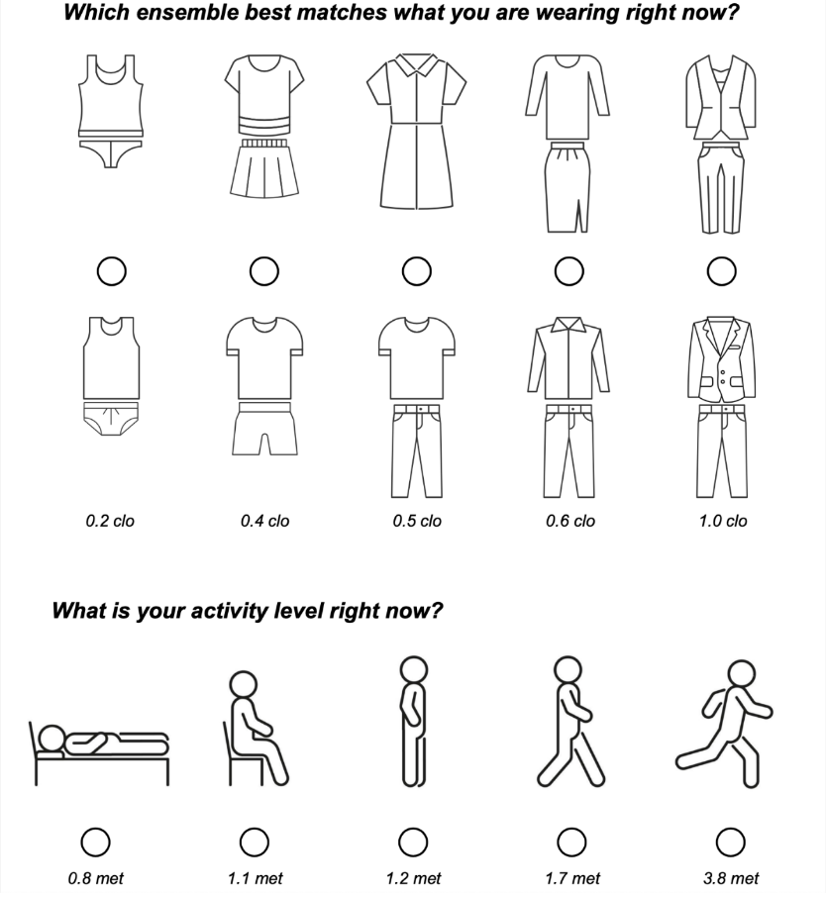

Surveys to assess thermal comfort
=================================

Occupant thermal environment surveys provide a practical method to assess comfort conditions within the satisfaction ranges outlined in this standard.
These surveys can directly measure the percentage of occupants who report being "satisfied" or "comfortable" by posing such questions to a representative sample.
Alternatively, satisfaction can be inferred using the ASHRAE thermal sensation scale, assuming satisfaction corresponds to a thermal sensation (TSENS) value within the range of –1.5 to +1.5 (with scale units of 0.5 or less) or –2 to +2 (with integer scales).

Surveys gather direct feedback on occupants’ comfort perceptions, unlike environmental measurements, which rely on models to predict perceptions indirectly.
However, surveys require careful planning and cannot always be used.
Effective communication strategies, concise and well-structured survey design, and careful consideration of timing and frequency are essential to minimise intrusiveness.
Surveys should aim for a representative sample size and high response rate, especially when assessing an entire building, to reduce the risk of generalisation errors.

Thermal environment surveys are invaluable diagnostic tools for existing buildings, offering insights into daily operations through occupant feedback.
Unlike broad environmental quality assessments, diagnostic surveys focus on detailed responses, regardless of survey size or response rate.
Two primary types of thermal environment surveys exist, each designed for specific objectives:

Point-in-time surveys
----------------------

Point-in-time surveys capture occupants’ thermal experiences at a single moment.
These surveys are widely used by researchers to correlate thermal comfort with environmental factors such as metabolic rate, clothing insulation, air temperature, radiant temperature, air speed, and humidity parameters integral to the PMV model.

A typical point-in-time survey includes questions about thermal sensation, using the ASHRAE seven-point scale (TSENS), and thermal satisfaction, rated from "very dissatisfied" to "very satisfied." Additional preference scales (e.g., preferences for temperature or air movement) may be included, as seen in the ASHRAE RP-884 database.
For point-in-time surveys to provide a comprehensive assessment of satisfaction over time, they must be conducted under diverse thermal conditions and operational modes.
However, logistical challenges in workplace environments often limit the feasibility of repeated surveys.
Web-based and mobile applications designed for building operations may help address this limitation.
For instance, you can use `Cozie <https://cozie-apple.app/>`_ - An iOS application for watch surveys and physiological data collection.

Thermal sensation
~~~~~~~~~~~~~~~~~

How do you feel right now?

.. list-table::
   :widths: 10 90
   :header-rows: 1

   * - Scale
     - Description
   * - -3
     - Cold
   * - -2
     - Cool
   * - -1
     - Slightly cool
   * - 0
     - Neutral
   * - +1
     - Slightly warm
   * - +2
     - Warm
   * - +3
     - Hot

Thermal satisfaction
~~~~~~~~~~~~~~~~~~~~

How satisfied are you with the thermal environment right now?

.. list-table::
   :widths: 10 90
   :header-rows: 1

   * - Scale
     - Description
   * - -3
     - Very dissatisfied
   * - -2
     - Dissatisfied
   * - -1
     - Slightly dissatisfied
   * - 0
     - Neutral
   * - +1
     - Slightly satisfied
   * - +2
     - Satisfied
   * - +3
     - Very satisfied

Thermal preference
~~~~~~~~~~~~~~~~~~

Right now, would you prefer to be ... ?

.. list-table::
   :widths: 10 90
   :header-rows: 1

   * - Scale
     - Description
   * - -1
     - Cooler
   * - 0
     - Without change
   * - +1
     - Warmer

Air movement preference
~~~~~~~~~~~~~~~~~~~~~~~

Right now, would you prefer ... ?

.. list-table::
   :widths: 10 90
   :header-rows: 1

   * - Scale
     - Description
   * - -1
     - Less air movement
   * - 0
     - No change
   * - +1
     - More air movement

Clothing and activity
~~~~~~~~~~~~~~~~~~~~~

Clothing and activity level can be assessed using the following questions:

Satisfaction Surveys
--------------------

Satisfaction surveys evaluate occupants’ thermal comfort responses over a specified period.
Instead of indirectly assessing dissatisfaction through environmental variables, these surveys directly ask occupants to rate their satisfaction.
For instance, satisfaction is calculated by the proportion of responses between +1 and +3 on a seven-point scale, while dissatisfaction is calculated from responses between –1 and –3.

These surveys allow occupants to reflect on past experiences, identify operational patterns, and provide "overall" comfort ratings.
Satisfaction surveys may also include questions about the sources of discomfort, aiding in diagnostics.
They are typically administered biannually or seasonally and should be performed six months after occupancy in new buildings to identify unresolved issues post-commissioning.
Facility managers, building operators, and researchers can use satisfaction surveys for performance evaluation in new constructions and ongoing post-occupancy assessments in existing buildings.

In summary, both point-in-time and satisfaction surveys are crucial tools for understanding and enhancing thermal comfort in buildings.
Proper planning and execution ensure their effectiveness in diagnosing issues and improving occupant satisfaction.
