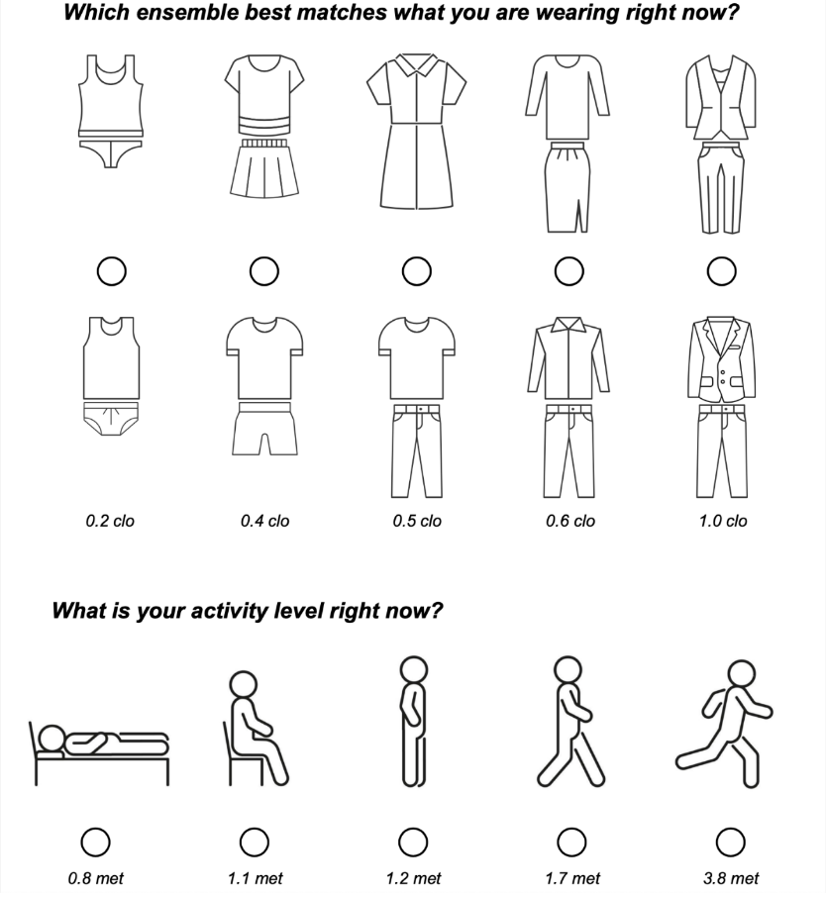

Comfort models
==============

Adaptive ASHRAE
---------------

.. autofunction:: pythermalcomfort.models.adaptive_ashrae.adaptive_ashrae

.. autoclass:: pythermalcomfort.classes_return.AdaptiveASHRAE
    :members:

Adaptive EN
-----------

.. autofunction:: pythermalcomfort.models.adaptive_en.adaptive_en

.. autoclass:: pythermalcomfort.classes_return.AdaptiveEN
    :members:

Adaptive Predicted Mean Vote (aPMV)
-----------------------------------

.. autofunction:: pythermalcomfort.models.a_pmv.a_pmv

.. autoclass:: pythermalcomfort.classes_return.APMV
    :members:

Adaptive Thermal Heat Balance (ATHB)
------------------------------------

.. autofunction:: pythermalcomfort.models.athb.athb

.. autoclass:: pythermalcomfort.classes_return.ATHB
    :members:

Adjusted Predicted Mean Votes with Expectancy Factor (ePMV)
-----------------------------------------------------------

.. autofunction:: pythermalcomfort.models.e_pmv.e_pmv

.. autoclass:: pythermalcomfort.classes_return.EPMV
    :members:

Apparent Temperature (AT)
-------------------------

.. autofunction:: pythermalcomfort.models.at.at

.. autoclass:: pythermalcomfort.classes_return.AT
    :members:

Ankle draft
-----------

.. autofunction:: pythermalcomfort.models.ankle_draft.ankle_draft

.. autoclass:: pythermalcomfort.classes_return.AnkleDraft
    :members:

Clothing prediction
-------------------

.. autofunction:: pythermalcomfort.models.clo_tout.clo_tout

.. autoclass:: pythermalcomfort.classes_return.CloTOut
    :members:

Cooling Effect (CE)
-------------------

.. autofunction:: pythermalcomfort.models.cooling_effect.cooling_effect

.. autoclass:: pythermalcomfort.classes_return.CE
    :members:

Discomfort Index (DI)
---------------------

.. autofunction:: pythermalcomfort.models.discomfort_index.discomfort_index

.. autoclass:: pythermalcomfort.classes_return.DI
    :members:

Gagge two-node model
--------------------

.. autofunction:: pythermalcomfort.models.gagge_two_nodes.gagge_two_nodes

.. autoclass:: pythermalcomfort.classes_return.GaggeTwoNodes
    :members:

Heat Index (HI)
---------------

.. autofunction:: pythermalcomfort.models.heat_index.heat_index

.. autoclass:: pythermalcomfort.classes_return.HI
    :members:

Humidex
-------

.. autofunction:: pythermalcomfort.models.humidex.humidex

.. autoclass:: pythermalcomfort.classes_return.Humidex
    :members:

Joint system thermoregulation model (JOS-3)
-------------------------------------------

.. autoclass:: pythermalcomfort.models.jos3.JOS3
    :members:
    :undoc-members:
    :special-members: __init__

Normal Effective Temperature (NET)
----------------------------------

.. autofunction:: pythermalcomfort.models.net.net

.. autoclass:: pythermalcomfort.classes_return.NET
    :members:

Predicted Heat Strain (PHS) Index
---------------------------------

.. autofunction:: pythermalcomfort.models.phs.phs

.. autoclass:: pythermalcomfort.classes_return.PHS
    :members:

Physiological Equivalent Temperature (PET)
------------------------------------------

.. autofunction:: pythermalcomfort.models.pet_steady.pet_steady

.. autoclass:: pythermalcomfort.classes_return.PETSteady
    :members:

Predicted Mean Vote (PMV) and Predicted Percentage of Dissatisfied (PPD)
------------------------------------------------------------------------

.. autofunction:: pythermalcomfort.models.pmv_ppd.pmv_ppd

.. autoclass:: pythermalcomfort.classes_return.PMVPPD
    :members:

Predicted Mean Vote (PMV)
-------------------------

.. autofunction:: pythermalcomfort.models.pmv.pmv

.. autoclass:: pythermalcomfort.classes_return.PMV
    :members:

Solar gain on people
--------------------

.. autofunction:: pythermalcomfort.models.solar_gain.solar_gain

.. autoclass:: pythermalcomfort.classes_return.SolarGain
    :members:

Standard Effective Temperature (SET)
------------------------------------

.. autofunction:: pythermalcomfort.models.set_tmp.set_tmp

.. autoclass:: pythermalcomfort.classes_return.SET
    :members:

Universal Thermal Climate Index (UTCI)
--------------------------------------

.. autofunction:: pythermalcomfort.models.utci.utci

.. autoclass:: pythermalcomfort.classes_return.UTCI
    :members:

Use Fans During Heatwaves
-------------------------

.. autofunction:: pythermalcomfort.models.use_fans_heatwaves.use_fans_heatwaves

.. autoclass:: pythermalcomfort.classes_return.UseFansHeatwaves
    :members:

Vertical air temperature gradient
---------------------------------

.. autofunction:: pythermalcomfort.models.vertical_tmp_grad_ppd.vertical_tmp_grad_ppd

.. autoclass:: pythermalcomfort.classes_return.VerticalTGradPPD
    :members:

Wet Bulb Globe Temperature Index (WBGT)
---------------------------------------

.. autofunction:: pythermalcomfort.models.wbgt.wbgt

.. autoclass:: pythermalcomfort.classes_return.WBGT
    :members:

Wind chill index
----------------

.. autofunction:: pythermalcomfort.models.wci.wci

.. autoclass:: pythermalcomfort.classes_return.WCI
    :members:

Wind chill temperature
----------------------

.. autofunction:: pythermalcomfort.models.wind_chill_temperature.wct

.. autoclass:: pythermalcomfort.classes_return.WCT
    :members:

Utilities functions
===================

Body Surface Area
-----------------

.. autofunction:: pythermalcomfort.utilities.body_surface_area

Dew point temperature
---------------------

.. autofunction:: pythermalcomfort.utilities.dew_point_tmp

Dynamic clothing
----------------

.. autofunction:: pythermalcomfort.utilities.clo_dynamic

Enthalpy
--------

.. autofunction:: pythermalcomfort.utilities.enthalpy_air

Intrinsic clothing insulation ensemble (Icl)
--------------------------------------------

.. autofunction:: pythermalcomfort.utilities.intrinsic_insulation_ensemble

Mean radiant temperature
------------------------

.. autofunction:: pythermalcomfort.utilities.mean_radiant_tmp

Operative temperature
---------------------

.. autofunction:: pythermalcomfort.utilities.operative_tmp

Psychrometric properties of air from dry-bulb temperature and relative humidity
-------------------------------------------------------------------------------

.. autofunction:: pythermalcomfort.utilities.psy_ta_rh

Relative air speed
------------------

.. autofunction:: pythermalcomfort.utilities.v_relative

Running mean outdoor temperature
--------------------------------

.. autofunction:: pythermalcomfort.utilities.running_mean_outdoor_temperature

Saturation vapor pressure
-------------------------

.. autofunction:: pythermalcomfort.utilities.p_sat

Sky-vault view fraction
-----------------------

.. autofunction:: pythermalcomfort.utilities.f_svv

Units converter
---------------

.. autofunction:: pythermalcomfort.utilities.units_converter

Wet bulb temperature
--------------------

.. autofunction:: pythermalcomfort.utilities.wet_bulb_tmp

Reference values clo and met
============================

Met typical tasks, [met]
------------------------

.. autodata:: pythermalcomfort.utilities.met_typical_tasks

**Example**

.. code-block:: python

    >>> from pythermalcomfort.utilities import met_typical_tasks
    >>> print(met_typical_tasks['Filing, standing'])
    1.4

Clothing insulation of typical ensembles, [clo]
-----------------------------------------------

.. autodata:: pythermalcomfort.utilities.clo_typical_ensembles

**Example**

.. code-block:: python

    >>> from pythermalcomfort.utilities import clo_typical_ensembles
    >>> print(clo_typical_ensembles['Typical summer indoor clothing'])
    0.5

Insulation of individual garments, [clo]
----------------------------------------

.. autodata:: pythermalcomfort.utilities.clo_individual_garments

**Example**

.. code-block:: python

    >>> from pythermalcomfort.utilities import clo_individual_garments
    >>> print(clo_individual_garments['T-shirt'])
    0.08

    >>> # calculate total clothing insulation
    >>> i_cl = clo_individual_garments['T-shirt'] + clo_individual_garments["Men's underwear"] +
    >>>        clo_individual_garments['Thin trousers'] + clo_individual_garments['Shoes or sandals']
    >>> print(i_cl)
    0.29

Surveys to assess thermal comfort
=================================

Occupant thermal environment surveys provide a practical method to assess comfort conditions within the satisfaction ranges outlined in this standard.
These surveys can directly measure the percentage of occupants who report being "satisfied" or "comfortable" by posing such questions to a representative sample.
Alternatively, satisfaction can be inferred using the ASHRAE thermal sensation scale, assuming satisfaction corresponds to a thermal sensation (TSENS) value within the range of –1.5 to +1.5 (with scale units of 0.5 or less) or –2 to +2 (with integer scales).

Surveys gather direct feedback on occupants’ comfort perceptions, unlike environmental measurements, which rely on models to predict perceptions indirectly.
However, surveys require careful planning and cannot always be used.
Effective communication strategies, concise and well-structured survey design, and careful consideration of timing and frequency are essential to minimise intrusiveness.
Surveys should aim for a representative sample size and high response rate, especially when assessing an entire building, to reduce the risk of generalisation errors.

Thermal environment surveys are invaluable diagnostic tools for existing buildings, offering insights into daily operations through occupant feedback.
Unlike broad environmental quality assessments, diagnostic surveys focus on detailed responses, regardless of survey size or response rate.
Two primary types of thermal environment surveys exist, each designed for specific objectives:

Point-in-time surveys
----------------------

Point-in-time surveys capture occupants’ thermal experiences at a single moment.
These surveys are widely used by researchers to correlate thermal comfort with environmental factors such as metabolic rate, clothing insulation, air temperature, radiant temperature, air speed, and humidity parameters integral to the PMV model.

A typical point-in-time survey includes questions about thermal sensation, using the ASHRAE seven-point scale (TSENS), and thermal satisfaction, rated from "very dissatisfied" to "very satisfied." Additional preference scales (e.g., preferences for temperature or air movement) may be included, as seen in the ASHRAE RP-884 database.
For point-in-time surveys to provide a comprehensive assessment of satisfaction over time, they must be conducted under diverse thermal conditions and operational modes.
However, logistical challenges in workplace environments often limit the feasibility of repeated surveys.
Web-based and mobile applications designed for building operations may help address this limitation.
For instance, you can use `Cozie <https://cozie-apple.app/>`_ - An iOS application for watch surveys and physiological data collection.

Thermal sensation
^^^^^^^^^^^^^^^^^

How do you feel right now?

.. list-table::
   :widths: 10 90
   :header-rows: 1

   * - Scale
     - Description
   * - -3
     - Cold
   * - -2
     - Cool
   * - -1
     - Slightly cool
   * - 0
     - Neutral
   * - +1
     - Slightly warm
   * - +2
     - Warm
   * - +3
     - Hot

Thermal satisfaction
^^^^^^^^^^^^^^^^^^^^

How satisfied are you with the thermal environment right now?

.. list-table::
   :widths: 10 90
   :header-rows: 1

   * - Scale
     - Description
   * - -3
     - Very dissatisfied
   * - -2
     - Dissatisfied
   * - -1
     - Slightly dissatisfied
   * - 0
     - Neutral
   * - +1
     - Slightly satisfied
   * - +2
     - Satisfied
   * - +3
     - Very satisfied

Thermal preference
^^^^^^^^^^^^^^^^^^

Right now, would you prefer to be ... ?

.. list-table::
   :widths: 10 90
   :header-rows: 1

   * - Scale
     - Description
   * - -1
     - Cooler
   * - 0
     - Without change
   * - +1
     - Warmer

Air movement preference
^^^^^^^^^^^^^^^^^^^^^^^

Right now, would you prefer ... ?

.. list-table::
   :widths: 10 90
   :header-rows: 1

   * - Scale
     - Description
   * - -1
     - Less air movement
   * - 0
     - No change
   * - +1
     - More air movement

Clothing and activity
^^^^^^^^^^^^^^^^^^^^^

Clothing and activity level can be assessed using the following questions:

Satisfaction Surveys
--------------------

Satisfaction surveys evaluate occupants’ thermal comfort responses over a specified period.
Instead of indirectly assessing dissatisfaction through environmental variables, these surveys directly ask occupants to rate their satisfaction.
For instance, satisfaction is calculated by the proportion of responses between +1 and +3 on a seven-point scale, while dissatisfaction is calculated from responses between –1 and –3.

These surveys allow occupants to reflect on past experiences, identify operational patterns, and provide "overall" comfort ratings.
Satisfaction surveys may also include questions about the sources of discomfort, aiding in diagnostics.
They are typically administered biannually or seasonally and should be performed six months after occupancy in new buildings to identify unresolved issues post-commissioning.
Facility managers, building operators, and researchers can use satisfaction surveys for performance evaluation in new constructions and ongoing post-occupancy assessments in existing buildings.

In summary, both point-in-time and satisfaction surveys are crucial tools for understanding and enhancing thermal comfort in buildings.
Proper planning and execution ensure their effectiveness in diagnosing issues and improving occupant satisfaction.

References
==========

.. [1] ANSI, & ASHRAE. (2020). Thermal Environmental Conditions for Human Occupancy. Atlanta.
.. [2] ISO. (2005). ISO 7730 - Ergonomics of the thermal environment — Analytical determination and interpretation of thermal comfort using calculation of the PMV and PPD indices and local thermal comfort criteria.
.. [3] EN, & BSI. (2019). Energy performance of buildings - Ventilation for buildings. BSI Standards Limited 2019.
.. [4] Schiavon, S., & Lee, K. H. (2013). Dynamic predictive clothing insulation models based on outdoor air and indoor operative temperatures. Building and Environment, 59, 250–260. doi.org/10.1016/j.buildenv.2012.08.024
.. [5] ISO. (1998). ISO 7726 - Ergonomics of the thermal environment instruments for measuring physical quantities.
.. [6] Stull, R., 2011. Wet-Bulb Temperature from Relative Humidity and Air Temperature. J. Appl. Meteorol. Climatol. 50, 2267–2269. doi.org/10.1175/JAMC-D-11-0143.1
.. [7] Zare, S., Hasheminejad, N., Shirvan, H.E., Hemmatjo, R., Sarebanzadeh, K., Ahmadi, S., 2018. Comparing Universal Thermal Climate Index (UTCI) with selected thermal indices/environmental parameters during 12 months of the year. Weather Clim. Extrem. 19, 49–57. https://doi.org/10.1016/j.wace.2018.01.004
.. [8] ISO, 2004. ISO 7933 - Ergonomics of the thermal environment — Analytical determination and interpretation of heat stress using calculation of the predicted heat strain.
.. [9] Błażejczyk, K., Jendritzky, G., Bröde, P., Fiala, D., Havenith, G., Epstein, Y., Psikuta, A. and Kampmann, B., 2013. An introduction to the universal thermal climate index (UTCI). Geographia Polonica, 86(1), pp.5-10.
.. [10] Gagge, A.P., Fobelets, A.P., and Berglund, L.G., 1986. A standard predictive Index of human reponse to thermal enviroment. Am. Soc. Heating, Refrig. Air-Conditioning Eng. 709–731.
.. [11] ISO, 2017. ISO 7243 - Ergonomics of the thermal environment — Assessment of heat stress using the WBGT (wet bulb globe temperature) index.
.. [12] Rothfusz LP (1990) The heat index equation. NWS Southern Region Technical Attachment, SR/SSD 90–23, Fort Worth, Texas
.. [13] Steadman RG (1979) The assessment of sultriness. Part I: A temperature-humidity index based on human physiology and clothing science. J Appl Meteorol 18:861–873
.. [14] Masterton JM, Richardson FA. Humidex, a method of quantifying human discomfort due to excessive heat and humidity. Downsview, Ontario: CLI 1-79, Environment Canada, Atmospheric Environment Service, 1979
.. [15] Havenith, G., Fiala, D., 2016. Thermal indices and thermophysiological modeling for heat stress. Compr. Physiol. 6, 255–302. DOI: doi.org/10.1002/cphy.c140051
.. [16] Blazejczyk, K., Epstein, Y., Jendritzky, G., Staiger, H., Tinz, B., 2012. Comparison of UTCI to selected thermal indices. Int. J. Biometeorol. 56, 515–535. DOI: doi.org/10.1007/s00484-011-0453-2
.. [17] Steadman RG (1984) A universal scale of apparent temperature. J Appl Meteorol Climatol 23:1674–1687
.. [18] ASHRAE, 2017. 2017 ASHRAE Handbook Fundamentals. Atlanta.
.. [20] Höppe P. The physiological equivalent temperature - a universal index for the biometeorological assessment of the thermal environment. Int J Biometeorol. 1999 Oct;43(2):71-5. doi: 10.1007/s004840050118. PMID: 10552310.
.. [21] Walther, E. and Goestchel, Q., 2018. The PET comfort index: Questioning the model. Building and Environment, 137, pp.1-10. DOI: doi.org/10.1016/j.buildenv.2018.03.054
.. [22] Teitelbaum, E., Alsaad, H., Aviv, D., Kim, A., Voelker, C., Meggers, F., & Pantelic, J. (2022). Addressing a systematic error correcting for free and mixed convection when measuring mean radiant temperature with globe thermometers. Scientific Reports, 12(1), 1–18. DOI: doi.org/10.1038/s41598-022-10172-5
.. [23] Liu, S., Schiavon, S., Kabanshi, A., Nazaroff, W.W., 2017. Predicted percentage dissatisfied with ankle draft. Indoor Air 27, 852–862. DOI: doi.org/10.1111/ina.12364
.. [24] Polydoros, Anastasios & Cartalis, Constantinos. (2015). Use of Earth Observation based indices for the monitoring of built-up area features and dynamics in support of urban energy studies. Energy and Buildings. 98. 92-99. 10.1016/j.enbuild.2014.09.060.
.. [25] Yao, Runming & Li, Baizhan & Liu, Jing. (2009). A theoretical adaptive model of thermal comfort – Adaptive Predicted Mean Vote (aPMV). Building and Environment. 44. 2089-2096. 10.1016/j.buildenv.2009.02.014.
.. [26] Fanger, P. & Toftum, Jorn. (2002). Extension of the PMV model to non-air-conditioned buildings in warm climates. Energy and Buildings. 34. 533-536. 10.1016/S0378-7788(02)00003-8.
.. [27] Schweiker, M., 2022. Combining adaptive and heat balance models for thermal sensation prediction: A new approach towards a theory and data‐driven adaptive thermal heat balance model. Indoor Air 32, 1–19. DOI: doi.org/10.1111/ina.13018
.. [28] Lu, Y.C. and Romps, D.M., Extending the Heat Index to Quantify the Physiological Response to Future Warming: A Modelling Study. Available at SSRN 3739854.
.. [29] ISO, EN (2009). ISO 9920 - Ergonomics of the thermal environment. Estimation of thermal insulation and water vapour resistance of a clothing ensemble

